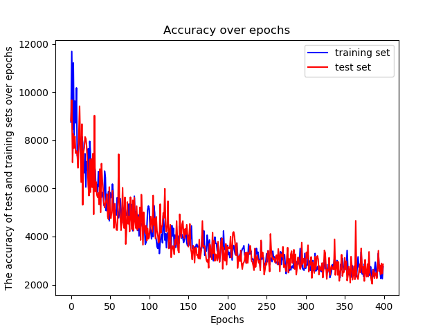

Learning process

In 'handID.py' I have the training for one shot learning model
In 'HandIDFunctions.py' I have the functions of training and testing for the one shot learning model
In 'Model.py' I have the models designed for gesture recognition
